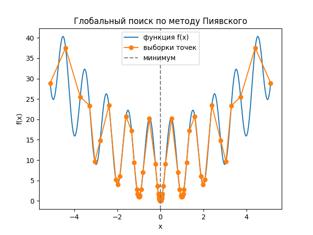
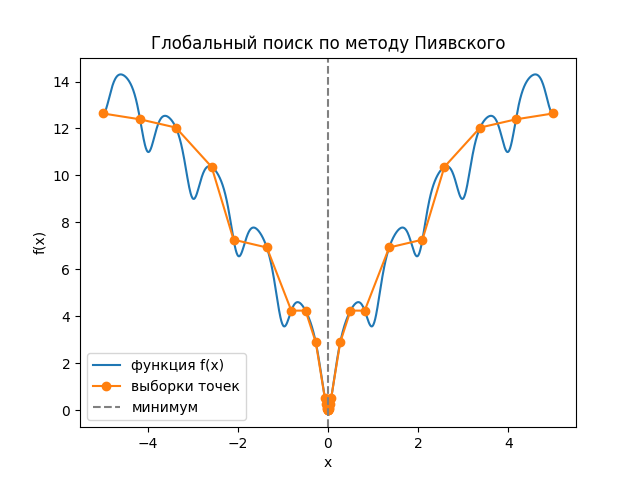
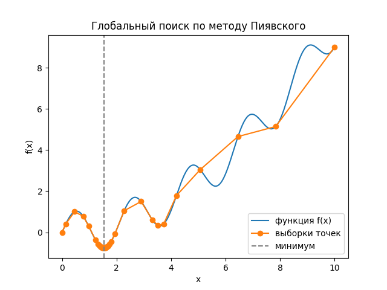

# Отчет по лабораторной работе №2
## Тема: Разработка программного обеспечения для решения задачи методом ломаных
Выполнил:

Студент: Шаповалов Сергей Кириллович

Группа: К3341

Поток: МЕТОПТ 1.1

Преподаватель: Юрий Бондарев

---


## Краткое описание алгоритма решения

Метод Пиявского предназначен для глобальной оптимизации одномерных функций, имеющих несколько локальных минимумов.

### Основная идея метода:

1. Оценивается константа Липшица L для функции (если неизвестна, вычисляется численно).

2. На интервале [a, b] строится кусочно-линейная нижняя огибающая функции.

3. Выбирается точка с минимальной оценкой огибающей для следующей выборки.

4. Процесс повторяется, пока расстояние между соседними точками не станет меньше заданной точности ε.

5. Возвращается точка с минимальным значением функции из всех выборок.


### Инструкция по запуску программы

Требования:

Python 3.8+

Установленный модуль numpy

#### Установка и запуск:

1. Клонировать или скачать проект в любую директорию:

```cmd
git clone <ссылка_на_репозиторий> 
cd MetOpt
```

2. Запустить скрипт:

```cmd 
python lab_2.py
```

3. Программа выведет пошаговое решение задачи, включая:

    1. вычислит глобальный минимум для заданной функции,

    2. выведет найденное приближенное значение x* и f(x*),

    3. покажет количество итераций и затраченное время,

    4. построит график функции с точками выборки и отмеченным минимумом.


## Демонстрация работы программы

### Пример 1 — Функция Растригина

Функция:

$$
f(x) = 10 + x^2 - 10 \cos(2\pi x)
$$

Интервал: [-5.12, 5.12], ε = 0.01

#### Вывод программы:




``` 
x* = 0.00000, f* = 0.00000, итераций = 72, время = 0.001 с
```


### Функция Ackley

Функция:

$$
f(x) = -20 e^{-0.2 |x|} - e^{\cos(2 \pi x)} + 20 + e
$$

Интервал: [-5, 5], ε = 0.01

#### Вывод программы:




``` 
x* = 0.00000, f* = 0.00000, итераций = 28, время = 0.000 с
```


### Пример 3 — Функция Синус с параболой

Функция:

$$
f(x) = 10 + x^2 - 10 \cos(2 \pi x)
$$

Интервал: [-5.12, 5.12], ε = 0.01

#### Вывод программы:




``` 
x* = 1.53962, f* = -0.75859, итераций = 44, время = 0.001 с
```


## Рефлективный вывод:


#### Работа над данной лабораторной позволила:

1. Освоить практическую реализацию метода глобальной оптимизации для одномерных функций.

2. Получить опыт оценки константы Липшица и построения нижней огибающей.

3. Hаучиться визуализировать процесс поиска минимума с помощью Python и matplotlib.

#### Полезное:

1. Понимание глобальной оптимизации и особенностей функций с множеством локальных минимумов.

2. Опыт работы с символьными выражениями через sympy и векторизованными функциями в numpy.

#### Трудности:

1. Подбор подходящей численной оценки L для корректной работы алгоритма.

2. Обеспечение точности вычислений на сложных функциях с высокой частотой колебаний (например, Растригина).

#### Итог:

Программа корректно находит глобальные минимумы, визуализирует процесс оптимизации и может использоваться для тестирования различных одномерных функций.